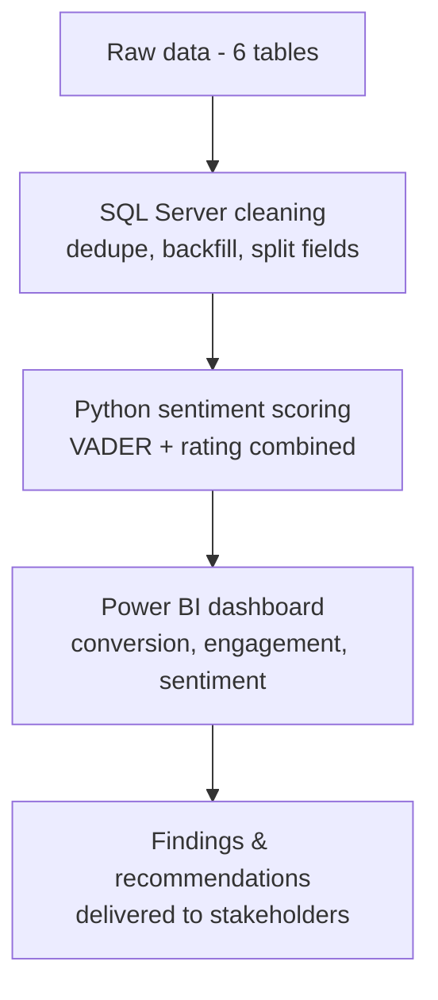

# ShopEasy Marketing Analytics

A marketing analytics project for a fictional online retailer (ShopEasy), based on two requests from management: figure out why engagement and conversions were dropping despite higher marketing spend, and make sense of the pile of unanalyzed customer reviews sitting on the side.

## The Task

Two emails kicked this off. The marketing manager wanted to know why increased ad spend wasn't translating into engagement or conversions. The customer experience manager separately wanted the backlog of reviews and social comments actually analyzed instead of just collected. Both pointed at the same gap: ShopEasy had the data, just no process for turning it into decisions. The ask was to dig into 2023–2025 site, campaign, and review data and come back with a dashboard plus actual recommendations.

## What I Did

Started in SQL Server, cleaning six raw tables into a proper star schema. The journey data had duplicate events, so I used `ROW_NUMBER()` partitioned on customer/product/date/stage/action to keep just the first occurrence of each, and backfilled a handful of missing `Duration` values with the day's average via `COALESCE` and a windowed `AVG()` rather than dropping the rows. The engagement data came in with views and clicks jammed into one string (`"1883-671"`), so that got split into separate columns, and inconsistent content-type labels got standardized. Product prices were bucketed into Low/Medium/High tiers to make segmentation easier later. All of that is in [`sql/`](./sql).

For the reviews, I built a small Python pipeline ([`scripts/customer_reviews_enrichment.py`](./scripts/customer_reviews_enrichment.py)) using NLTK's VADER to score sentiment on the cleaned review text. Rather than trusting either the star rating or the sentiment score alone, I combined them: a 3-star review with genuinely negative wording gets flagged differently than a 3-star review that just reads as neutral. Output feeds [`data/processed/fact_customer_reviews_with_sentiment.csv`](./data/processed).

Everything came together in a Power BI dashboard covering conversion trends, engagement by content type, and review sentiment over time.

## What the Data Showed

Conversion was seasonal, not steadily declining:

| Month | Conversion Rate | Note |
|---|---|---|
| January | 17.3% | Highest of the year, driven by Ski Boots converting near 100% |
| October | 6.1% | Lowest, no single product carrying the month |
| December | 11.4% | Recovered on holiday sales |

Engagement told a top-of-funnel story more than an engagement-quality one. Views were strong through Q1 and fell steadily after, but the people who did click through engaged at a solid 19.66% rate, and clicks/likes stayed flat relative to views the whole year. Blog content pulled in far more views than social or video.

Reviews skewed positive overall (840 positive vs. 226 negative sentiment, average rating 3.69 against a 4.0 target), but there was a meaningful "mixed" segment sitting in between, neither clearly happy nor clearly unhappy.

## Recommendation

**Lean into what already converts.** January's spike wasn't random, it was Ski Boots and seasonal demand lining up. Kayaks, Ski Boots, and Baseball Gloves all convert well in their respective seasons, so timing campaigns around January and September (rather than spreading budget evenly all year) should lift conversion in the months that currently underperform.

**Fix the top of the funnel, not the bottom.** With CTR already healthy among engaged users, the real lever is getting more people to view content in the first place, especially outside Q1. That means diversifying beyond blog posts, testing more interactive or user-generated content, and tightening calls to action from September through December when engagement typically fades.

**Target the mixed reviews, not just the negative ones.** Outright negative reviews are a smaller, harder group to win back. The mixed segment is closer to positive already, so a simple process for flagging and following up on mixed/neutral reviews is more likely to move the average rating toward the 4.0 goal than chasing the lowest-rated feedback.

## Dashboard

[`Marketing_Analysis_Dashboard.pbix`](./Marketing_Analysis_Dashboard.pbix), built in Power BI Desktop. Covers the conversion funnel and monthly trend, engagement by content type and campaign, and review sentiment by product and over time.

## Files

- [`sql/`](./sql) — dimension and fact table scripts (customers, products, journey, reviews, engagement)
- [`scripts/customer_reviews_enrichment.py`](./scripts/customer_reviews_enrichment.py) — the sentiment scoring pipeline
- [`data/raw/`](./data/raw) — original CSV exports
- [`data/processed/`](./data/processed) — sentiment-enriched review data
- [`Marketing_Analysis_Dashboard`](./Marketing_Analysis_Dashboard.pbix) — the Power BI report
- [`presentations/`](./presentations) — the original business case and the findings deck presented to stakeholders
- [`database_backup/`](./database_backup) — full SQL Server backup for reproducing the source DB
